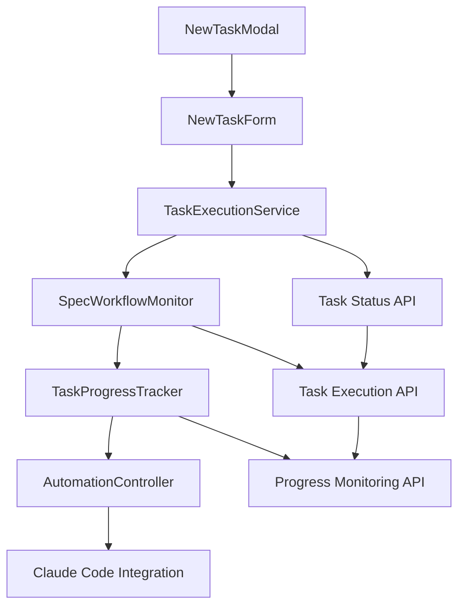

# Design Document

## Overview

The Task Feature extends the Claude Code Viewer's interactive capabilities by adding automated task execution functionality. This feature integrates with the existing spec-workflow system to provide users with a streamlined way to execute predefined prompts and monitor task completion automatically. The design follows the existing modal-based pattern (similar to "Start New Chat") and leverages the current chat management infrastructure while adding task-specific monitoring and automation logic.

## Steering Document Alignment

### Technical Standards (tech.md)

- **Next.js App Router**: Follows established routing patterns in `/projects/[projectId]/` structure
- **React 19 + TypeScript**: Uses modern React patterns with strict TypeScript typing
- **Hono.js API Integration**: Extends existing API routes with task management endpoints
- **TanStack Query**: Leverages existing server state management for task progress caching
- **Zod Validation**: Implements runtime validation for task configurations and spec-workflow data
- **Jotai State Management**: Uses atomic state management for task execution status

### Project Structure (structure.md)

- **Feature-based Organization**: Task components grouped under `/projects/[projectId]/components/newTask/`
- **Co-location Principle**: Task-related hooks, services, and utilities placed near usage
- **Layer Separation**: UI components separate from business logic services
- **Naming Conventions**: Follows PascalCase for components, camelCase for functions
- **Import Patterns**: Maintains established order (external, internal absolute, relative)

## Code Reuse Analysis

### Existing Components to Leverage

- **NewChatModal.tsx**: Pattern and structure for task modal UI design
- **ChatInput**: Input component for predefined prompt entry 
- **useChatMutations**: Mutation patterns for starting new chat sessions
- **Dialog Components**: shadcn/ui Dialog primitives for modal implementation
- **Button Components**: Consistent UI button styling and behavior
- **honoClient**: Existing API client for server communication

### Integration Points

- **Claude Code Task Controller**: Existing `ClaudeCodeTaskController.ts` for task management integration
- **Server-Sent Events**: Existing SSE infrastructure for real-time task status updates
- **Project Context**: Integration with current project routing and state management
- **Conversation Monitoring**: Extension of existing conversation parsing for tool usage detection

## Architecture

The Task Feature implements a three-layer architecture following established patterns:

1. **Presentation Layer**: React components for task creation, monitoring, and control
2. **API Layer**: Hono.js routes for task management and status monitoring
3. **Service Layer**: Business logic for task automation, progress tracking, and error handling

### Modular Design Principles

- **Single File Responsibility**: Each component handles one specific concern (modal, monitoring, automation)
- **Component Isolation**: Small, focused components with clear interfaces
- **Service Layer Separation**: Task logic separated from UI presentation
- **Utility Modularity**: Task-specific utilities for validation and monitoring



## Components and Interfaces

### NewTaskModal Component
- **Purpose:** Modal interface for creating new automated tasks
- **Interfaces:** `{ projectId: string, trigger?: ReactNode }`
- **Dependencies:** Dialog primitives, Button components
- **Reuses:** NewChatModal pattern, existing modal infrastructure

### NewTaskForm Component
- **Purpose:** Form for configuring task parameters (prompt, completion conditions)
- **Interfaces:** `{ projectId: string, onSubmit: (config: TaskConfig) => Promise<void> }`
- **Dependencies:** Form validation, input components
- **Reuses:** ChatInput component, validation patterns

### TaskExecutionService
- **Purpose:** Manages automated task execution lifecycle
- **Interfaces:** `startTask(config: TaskConfig)`, `cancelTask(taskId: string)`, `getTaskStatus(taskId: string)`
- **Dependencies:** Claude Code API, progress monitoring
- **Reuses:** Existing chat mutation patterns, API client

### SpecWorkflowMonitor
- **Purpose:** Monitors conversation history for spec-workflow tool usage
- **Interfaces:** `monitorConversation(sessionId: string)`, `parseToolResult(result: any)`
- **Dependencies:** Conversation parsing, data validation
- **Reuses:** Existing conversation schema, Zod validation

### TaskProgressTracker
- **Purpose:** Tracks and validates task completion progress
- **Interfaces:** `updateProgress(progress: TaskProgress)`, `validateStructure(data: any)`
- **Dependencies:** Error handling, validation logic
- **Reuses:** Existing error handling patterns

### AutomationController
- **Purpose:** Controls automatic task continuation and completion detection
- **Interfaces:** `checkCompletion(progress: TaskProgress)`, `continueExecution(config: TaskConfig)`
- **Dependencies:** Task execution service, progress validation
- **Reuses:** Existing mutation patterns, async handling

## Data Models

### TaskConfig
```typescript
interface TaskConfig {
  id: string;                    // Unique task identifier
  projectId: string;             // Associated project ID
  prompt: string;               // Predefined prompt text
  completionCondition: 'spec-workflow'; // Completion detection method
  createdAt: Date;              // Task creation timestamp
  status: 'pending' | 'running' | 'completed' | 'cancelled' | 'error';
}
```

### TaskProgress
```typescript
interface TaskProgress {
  taskId: string;               // Associated task ID
  sessionId?: string;           // Current Claude session ID
  totalTasks: number;          // Total tasks from spec-workflow
  completedTasks: number;      // Completed tasks count
  lastUpdated: Date;           // Last progress update
  toolResults: SpecWorkflowResult[]; // Captured tool results
}
```

### SpecWorkflowResult
```typescript
interface SpecWorkflowResult {
  toolName: 'mcp__spec-workflow__manage-tasks';
  timestamp: Date;
  data: {
    success: boolean;
    message: string;
    data: {
      summary: {
        total: number;
        completed: number;
        inProgress: number;
        pending: number;
      };
    };
  };
}
```

## Error Handling

### Error Scenarios

1. **Spec-workflow Data Structure Changes**
   - **Handling:** Validate data.summary structure, throw descriptive error if missing
   - **User Impact:** Clear error message with guidance to check spec-workflow specification

2. **Claude Code Session Failures**
   - **Handling:** Capture session errors, pause automation, display error details
   - **User Impact:** Task pauses with retry option and detailed error information

3. **Task Monitoring Connection Loss**
   - **Handling:** Implement retry logic with exponential backoff, fallback to manual checking
   - **User Impact:** Status indicator shows connection issues, manual refresh option

4. **Invalid Task Configuration**
   - **Handling:** Client-side validation before submission, server-side validation with clear errors
   - **User Impact:** Form validation errors with specific field guidance

## Testing Strategy

### Unit Testing
- Task configuration validation logic
- Spec-workflow data structure parsing
- Error handling for data structure changes
- Progress calculation and completion detection